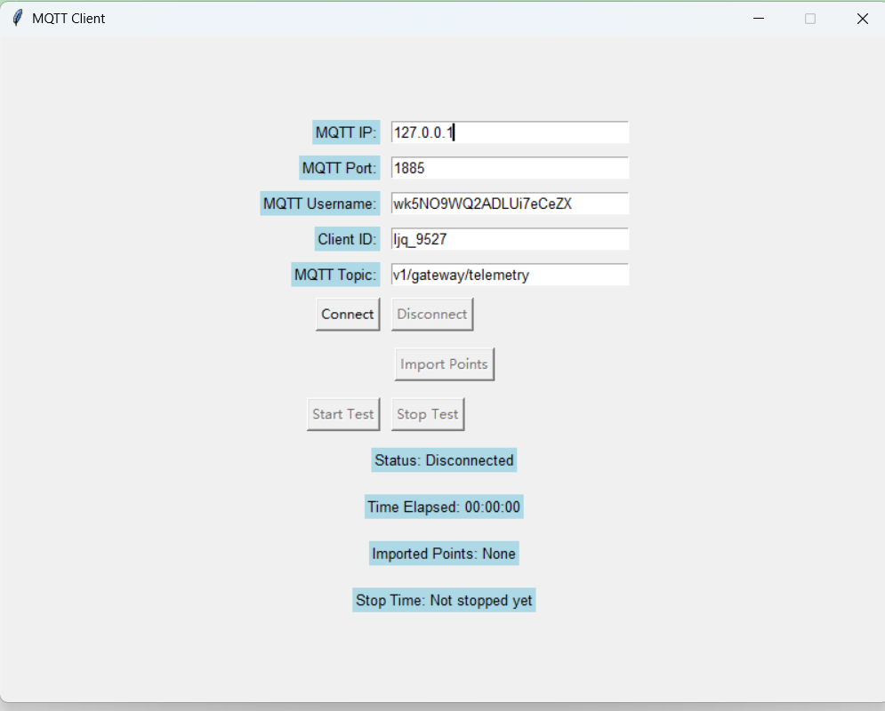

# mqtt_data_mock
将数据通过mqtt推送到服务端，支持windows及linux操作系统


主要功能：
1. 作为MQTT客户端，能让用户手动设置MQTT的IP 端口 用户名，并且能随机/手动输入客户端ID，默认MQTT版本5.0，连接超时时长10秒，keep alive 60秒。 
2. 用户设置完后，可以点击连接按钮进行测试，测试通过后，进行连接。 
3. 连接成功后，可以让用户手动选择txt文本进行导入，txt文本中包含多个点位信息，以英文逗号隔开，如: iot1,iot2,iot3 
4. 导入完成后，给对应的MQTT发送消息，发送消息格式为JSON，内容如下：
5. 其中iot1、iot2等是从刚才的txt中取得，具体test1、test2，是固定的，需要从test1到test200，对应的数值随机，从-100到100，可以有两位小数。按每秒一次的频率进行数据发送。 
6. 界面提供开始测试按钮，提供一个计数器，提示程序运行时间（时分秒格式） 

推送数据格式：

```
{
	"iot1": [{
		"test1": 3.8,
		"test2": 3.0,
		"test3": 3.0
	}],
	"iot2": [{
		"test1": 3.8,
		"test2": 3.0,
		"test3": 3.0
	}],
	"iot3": [{
		"test1": 3.8,
		"test2": 3.0,
		"test3": 3.0
	}]
}
```

